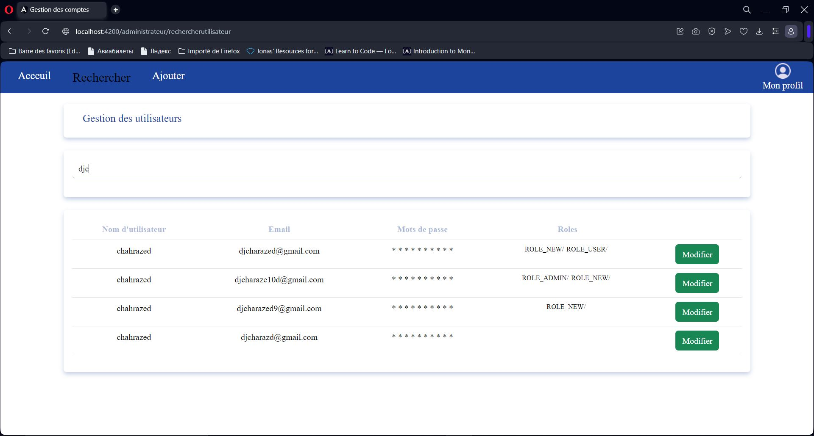

# User Account Management

This is the English version of the README. For French, please refer to [README_FR.md](./README_FR.md).

## Description

>  CM Consulting intends to implement a simple yet effective user account management system. This system aims to facilitate the
management of various user-related operations, thus providing a robust user account management system.

  

## Development Tools and Environment
- Postman (for API testing)
- VsCode, Figma...
- Backend:
   - Java Spring Boot
   - MySQL Database
- Frontend:
   - HTML
   - CSS
   - Angular
   - Bootstrap
   - (js)
## Project Management
- GitHub/Git Integration
- Trello Integration
- Preparation of a simple estimation document including costs and deadlines
- Application of UML diagrams
- Creation of a simple user guide
- Development of technical and functional documentation
  
## Application Overview
It is based on REST APIs that allow the following scenarios:
- Register a new user
- Modify user information
- Search for users
- Display details of a user account
- Add a user
- Login and logout of a user account
- Multilingual support for French, English, and Arabic
  
## Installation
To install this project from GitHub, follow these steps. Make sure you have Git, Angular, and Java Spring Boot installed on your system before starting:
- Open a terminal and use the command: `git clone https://github.com/Chahrazed-DJ/users-account-management.git`
- Access the Project Directory: cd project-name
- You will find two parts: backend and frontend
- Start with the backend: open the folder separately and launch the Java Spring Boot project server. If you are using VS Code, position yourself on the class that launches the project and execute `Run Java`
- For the frontend, Angular requires starting the server using the command `ng serve --open`. You will see the application ready to be launched in the browser
- In case of dependency issues, `run npm install`
  
#### Some interfaces 
<table align="center">

  <tr>
    <td>    </td>
    <td>    </td>
  </tr>
</table>
<table align="center">
  <tr>
    <td width="700px">    </td>
  </tr>
</table>

<table align="center">
  <tr>
    <th>
    📝 You will find a detailed user manual as well as technical documentation that provides tool installation steps
    </th>
  </tr>
</table>
