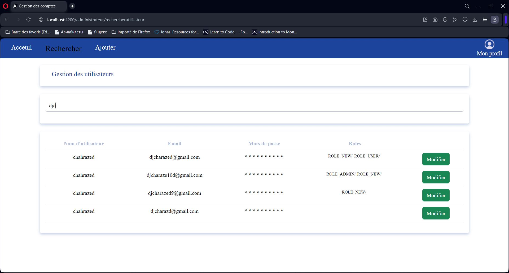

# Gestion des comptes utilisateurs
Ceci est la version française du README. Pour l'anglais, veuillez consulter [README.md](./README.md).

## Description

> La société CM Consulting a l’intention de mettre en œuvre un système de gestion des
comptes utilisateurs simple mais efficace. Ce système vise à faciliter la gestion de diverses
opérations liées aux utilisateurs, offrant ainsi n système résistant de gestion des comptes utilisateurs.

  

## Outils et environnement de développement
- Postman ( pour le test des APIs )
- VsCode, Figma ...
- Bakend :
  - Java Spring Boot
  - Base de données MySQL
- Frontend :
  - HTML
  - CSS
  - Angular
  - Bootstrap
  - (js)
## En ce qui concerne la gestion de projet
- Intégration de Github/Git
- Intégration de Trello
- Élaboration d'un document simple d'estimation comprenant les charges et les délais
- Appliquation des diagrammes UML
- Élaboration d'un guide d'utilisation simple
- Créeation de la documentation technique et fonctionnelle
  
## En ce qui concerne l'application
Elle est basée sur des REST APIs qui permettent les scénarios suivants:
- Enregistrer un nouvel utilisateur 
- Modification des informations de l’utilisateur
- Rechercher des utilisateurs
- Afficher le détail d’un compte utilisateur
- Ajouter un utilisateur
- Connexion et déconnexion à un compte utilisateur
- • Multilingue pour le français, l'anglais et l'arabe
## Installation 
Pour installer ce projet depuis GitHub, vous pouvez suivre ces étapes. Assurez-vous d'avoir Git, angular et java spring boot installés sur votre système avant de commencer :
- Ouvrez un terminal et utilisez la commande : `git clone https://github.com/Chahrazed-DJ/users-account-management.git`
- Accéder au Répertoire du Projet: cd nom-projet
- Vous allez trouver deux parties backend et frontend
- Commencez par la partie backend : ouvrez le dossier séparément et lancez le serveur du projet Java Spring Boot. Si vous utilisez VS Code, positionnez-vous sur la classe qui lance le projet et exécutez `Run Java`
- Pour la partie frontend, Angular nécessite de lancer le serveur via la commande `ng serve --open`. Vous verrez l'application prête à être lancée dans le navigateur
-  En cas de problème de dépendances, exécutez `npm install`
  
#### Quelques interfaces 
<table align="center">

  <tr>
    <td>    </td>
    <td>    </td>
  </tr>
</table>
<table align="center">
  <tr>
    <td width="700px">    </td>
  </tr>
</table>

<table align="center">
  <tr>
    <th>
    📝 Vous trouverez un manuel d'utilisation détaillé ainsi qu'une documentation technique qui fournit des étapes d'installation des outils
    </th>
  </tr>
</table>
